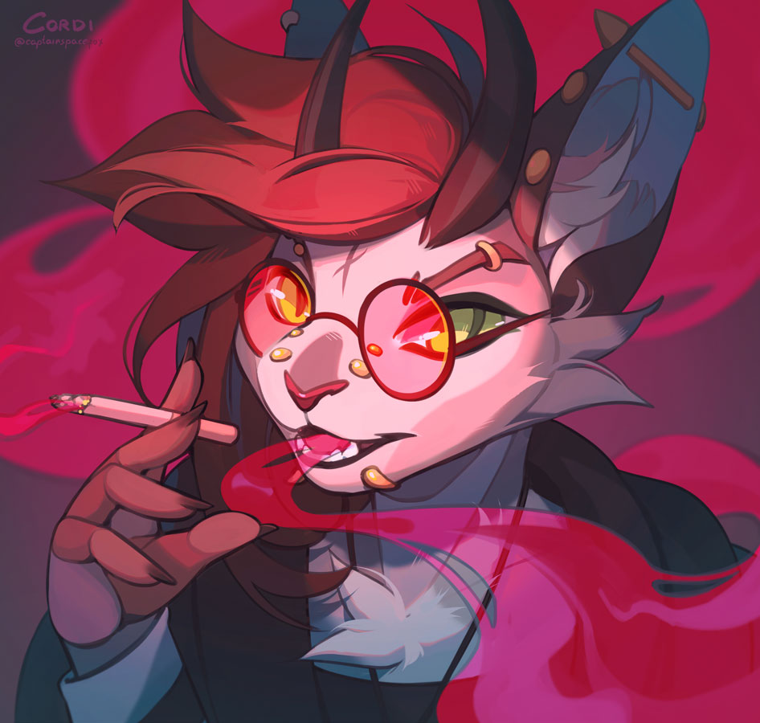

# Character Brainstorming

## Backstory

- Created as an experiment
  - Innate magic because of it
    - Magic very tied to emotion
    - Low level = low control, instead of low level = low power
  - Shapeshift abilities
    - Technically a changeling, mechanically
- Who were they before the experiment
  - Someone of importance?
    - Experimented on because their parents wanted to make them "better"?
  - Someone unimportant?
    - Experimented on because nobody would care?

