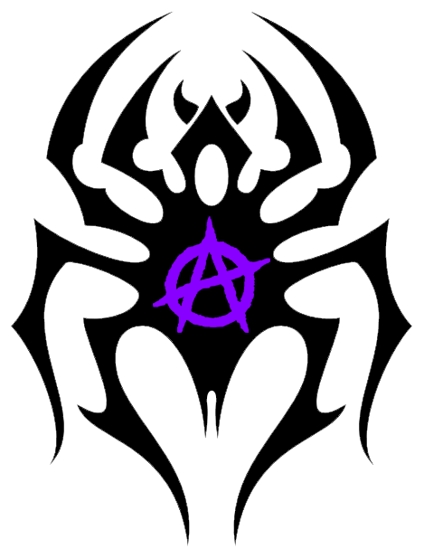

# Anansi

- Spider
- 20 y/o
- She/her
- Hacktivist
- Scenecore enthusiast

Anansi is a black spider with neon purple accents. She's a hacktivist and cybersecurity enthusiast.

## Aesthetics and Inspiration

Anansi is heavily inspired by the neon aesthetics of scenecore as well as old-school rave aesthetics and rhythm games like DDR. Themes of rebellion and anarchy are also common.

### Top Inspo

- [Rotteen - Like a Fuckin' Sun](https://www.youtube.com/watch?v=4tdBDTBqTQo)
- [fur:trash](https://soundcloud.com/furtrash)
- [Sickmode](https://open.spotify.com/artist/5PbgCU02dfdBCAzpOaNmYW)
- [Knock2](https://open.spotify.com/artist/6mmSS7itNWKbapgG2eZbIg)

## History

// TODO

## Art

I have no original art of Anansi, and while I do have inspiration art, I don't want to display it here as if it's her, because it isn't. If you want to see it as a reference for whatever, let me know and I'll send it. In leiu of that, though, here are some graphics I made that sortof showcase the vibes:

