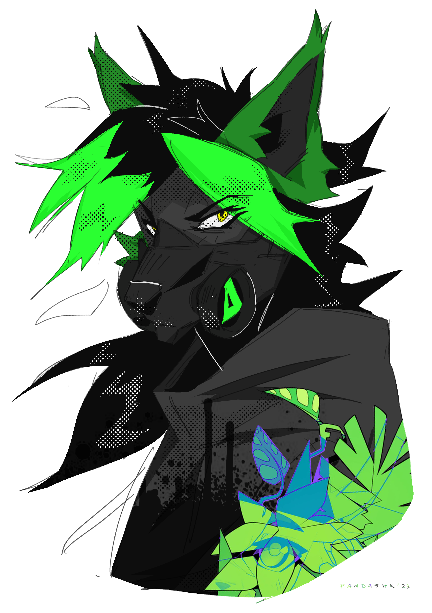

# Cambium

- Wolf alien
- Unknown age
- They/them
- Visions of the future
- Graffiti enthusiast

Cambium is an alien wolf with lime green accents. They enjoy cultivating plants and creating art - in both audio and visual mediums. They are never seen without their gas mask.

## Aesthetics and Inspiration

Aesthetically, Cambium tends to use a solarpunk-dystopia style, overgrown architecture and pristine gardens fallen into ruins and overtaken by the plants once grown there. They make minimal drum and bass with ambient and noise influences.

### Top Inspo

- [The State of DNB 2020](https://lapfox.bandcamp.com/album/the-state-of-dnb-2020)
- [_SNDWRK/gh](https://lapfox.bandcamp.com/album/sndwrk-gh)
- [arc,regn](https://lapfox.bandcamp.com/album/arc-regn)
- [hyi](https://lapfox.bandcamp.com/album/about)

## History

// TODO

## Art

