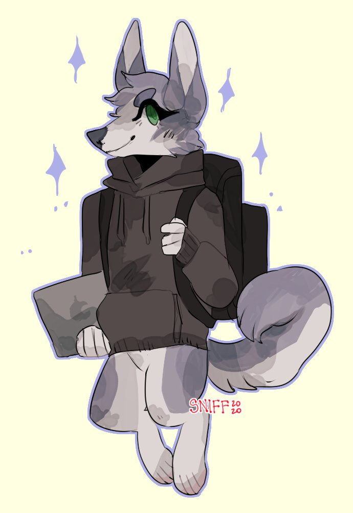

# Carmen Devereaux

- Husky
- 23 y/o
- She/her
- Software engineer
- Outdoors enthusiast

Carmen is a grey-blue husky. She spends most of her time travelling, camping wherever she can and working as a software and web developer remotely from her laptop.

## Aesthetics and Inspiration

Carmen is a softie, she enjoys songs like lo-fi and cozy nature and camping aesthetics like rain on a tent. She enjoys stargazing, and the sounds of nature.

### Top Inspo

- [In Love With a Ghost](https://open.spotify.com/artist/21tDFddcOFDYmiobTcls2O)
- [Tomppabeats](https://open.spotify.com/artist/0Q2Tc5yZFJpumLMc7Yz4e4)
- [myNoise](https://mynoise.net/)

## History

// TODO

## Art

