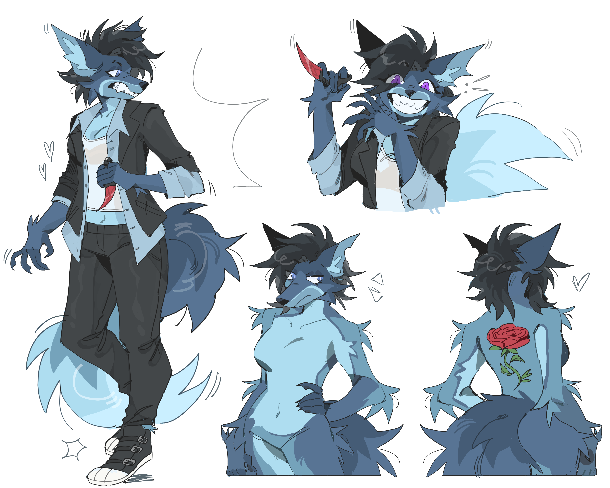

# Rose Keres

- Wolf
- 32 y/o
- She/her
- Assassin & bodyguard
- Cocaine and murder enthusiast

Rose is a blue/gray wolf. She started out working as a bodyguard for the collective, but has gradually turned into a member. She uses drugs relatively heavily, her favorite being a drug called Lumina, which alters vision and gives intense feelings of euphoria. She has a red karambit she named Thanatos that she keeps on her at all times.

## Aesthetics and Inspiration

Rose makes overdriven, shout-y rap and intense ear-splitting noise music. Much of her art has acid-like aesthetics and blood or drug references.

### Top Inspo

- [Grim Salvo](https://open.spotify.com/artist/5UogEGDRYo5Q9bRIMRjuEC)
- [sewnfkt](https://soundcloud.com/sewnfkt)
- [Syprexa](https://open.spotify.com/artist/04NjoLMWKNWGJPbn7g5jG0)
- [1 800 PAIN](https://open.spotify.com/artist/7BT9qietxZuylsjyWGYBUR)

## History

// TODO

## Art

