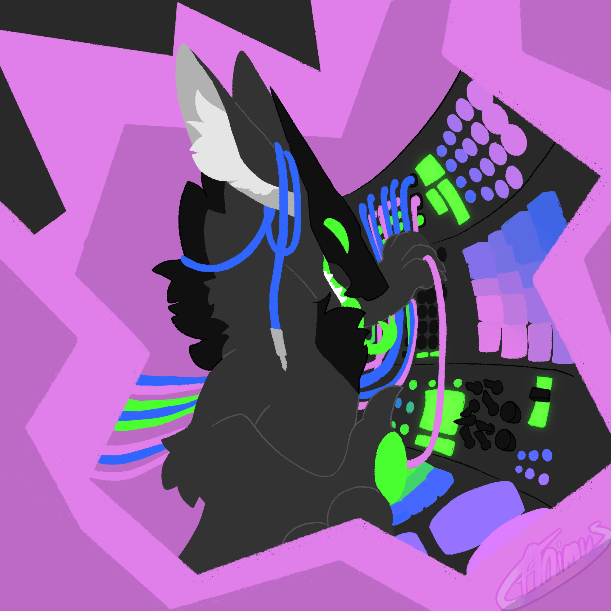
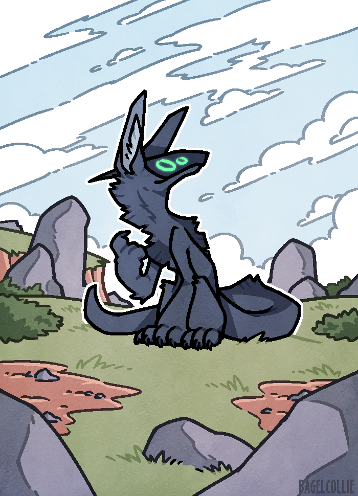

# Sylas

- Mantled beast
- Age anywhere from 20s to 200s. Need to decide
- Gender fluid
- Vintage/niche tech nerd
- Data corruption enthusiast

Sylas is a grey/black mantled beast. He's very interested in anything niche related to tech, and gets very focused on the minutiae of how things work, so he can mess with them. He's outoging and friendly, and will happily talk your ear off about anything he's interested in. He enjoys technical computing and fiddling with computer hardware to produce interesting results.

## Aesthetics and Inspiration

Sylas's art focuses mainly on technical creation. He enjoys old, analogue hardware and deprecated software, as well as intentionally corrupting data to produce unique outputs. Much of the music he makes is technical, sample-heavy genre-fusion, and makes heavy use of technology like trackers, modular synthesizers, and EMF recordings.

### Top Inspo

- [Frums](https://soundcloud.com/frums)
- [Richard Devine](https://twitter.com/RichardDevine)
- [qebrus](https://open.spotify.com/artist/1Z2PmjLduWIJxXbk8TlDoK)

## History

 // TODO

## Art

